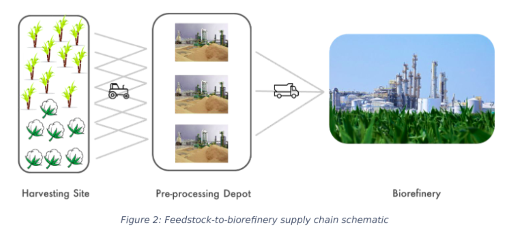

# SHELL-AI Hackathon 2023: Waste To Energy

## Motivation

To set up a biorefinery in a region, an **understanding of the region’s current and future biomass produce** will be required. 

This biomass needs to be:
1. Collected and transported to intermediate depots for **de-moisturisation and densification into pellets**.
2. The pellets will then need to be **transported to the biorefinery** for conversion to biofuel. 



This incurs high cost of feedstock transportation and associated GHG emissions, which will need to be minimised too. The value it generates lies not only in contribution to the global energy transition, but also benefits farmers as a sustainable source of
income.

## Problem Goal

Using the provided data, you are required to forecast biomass availability as well as design the optimal supply chain for the years 2018 and 2019, following the objective and constraints given in the subsequent sections.

1. Biomass Forecast (biomass_forecast)
2. Set Optimal Location for:
- Depots (depot_location): Where the biomass is pelletized (i.e. packed)
- Refineries (refinery_location): Where the pellets are used for energy generation.
3. The supplies for
- Depots (biomass_demand_supply)
- Refineries (pellet_demand_supply)

## Objective Functions and Constraints

$$
Cost_{transport} = \left(\sum_{i, j}D_{i,j}Biomass_{i,j}\right) + \left(\sum_{j, k}D_{j, k}Pellet_{j, k}\right)
$$

$$
Cost_{forecast} = MAE\left(Biomass_{i, j}, Biomass_{i, j}^{forecast}\right)
$$

$$
Cost_{underuse} = \sum_{i, j}\left(Cap_{depot} - \sum_{i,j}Biomass_{i, j}\right) + \sum_{j, k}\left(Cap_{refinery} - \sum_{j, k}Biomass_{j, k}\right)
$$

$$
Cost = 0.001Cost_{transport} + Cost_{forecast} + Cost_{underuse}
$$

1. All values (forecasted biomass, biomass demand-supply, pellet demand-supply) must be
greater than or equal to zero.

$$
Biomass_{i}^{forecast} >= 0,\quad Biomass_{i, j} >= 0,\quad Pellet_{j, k} >=0
$$

2. The amount of biomass procured for processing from each harvesting site ′𝑖′ must be less than or equal to that site’s forecasted biomass.

$$
\sum_{j}Biomass_{i, j} <= Biomass_{i}^{forecast}
$$

3. Total biomass reaching each preprocessing depot ′𝑗′ must be less than or equal to its yearly processing capacity (20,000).

$$
\sum_{i}Biomass_{i, j} <= Cap_{depot}^j
$$

4. Total pellets reaching each refinery ′𝑘′ must be less than or equal to its yearly processing capacity (100,000).

$$
\sum_{j}Pellet_{j, k} <= Cap_{refinery}^k
$$

5. Number of depots should be less than or equal to 25.

$$
j<=25
$$

6. Number of refineries should be less than or equal to 5.

$$
k<=5
$$

7. At least 80% of the total forecasted biomass must be processed by refineries each year.

$$
\sum_{j, k}Pellet_{j, k, year} >= 0.8\sum_{i, j}Biomass^{forecast}_{i, j, year}
$$

8. Total amount of biomass entering each preprocessing depot is equal to the total amount of
pellets exiting that depot (within tolerance limit of 1e-03).

$$
\sum_{i}Biomass_{i, j} = \sum_{k}Pellet_{j, k}
$$


# Data


```python
import pandas as pd
import numpy as np
```


```python
cap_depot = 20_000
cap_ref = 100_000
n_depots = 25
n_ref = 5
min_proc_bio_rate = 0.8
```

## Biomass History

A time-series of biomass availability in the state of Gujarat from year
2010 to 2017. We have considered arable land as a map of 2418 equisized grid blocks
(harvesting sites). For ease of use, we have flattened the map and provided location index,
latitude, longitude, and year wise biomass availability for each Harvesting Site


```python
df_bio = pd.read_csv('../../data/Biomass_History.csv')
df_bio.head()
```


<table border="1" class="dataframe">
  <thead>
    <tr style="text-align: right;">
      <th></th>
      <th>Index</th>
      <th>Latitude</th>
      <th>Longitude</th>
      <th>2010</th>
      <th>2011</th>
      <th>2012</th>
      <th>2013</th>
      <th>2014</th>
      <th>2015</th>
      <th>2016</th>
      <th>2017</th>
    </tr>
  </thead>
  <tbody>
    <tr>
      <th>0</th>
      <td>0</td>
      <td>24.66818</td>
      <td>71.33144</td>
      <td>8.475744</td>
      <td>8.868568</td>
      <td>9.202181</td>
      <td>6.023070</td>
      <td>10.788374</td>
      <td>6.647325</td>
      <td>7.387925</td>
      <td>5.180296</td>
    </tr>
    <tr>
      <th>1</th>
      <td>1</td>
      <td>24.66818</td>
      <td>71.41106</td>
      <td>24.029778</td>
      <td>28.551348</td>
      <td>25.866415</td>
      <td>21.634459</td>
      <td>34.419411</td>
      <td>27.361908</td>
      <td>40.431847</td>
      <td>42.126946</td>
    </tr>
    <tr>
      <th>2</th>
      <td>2</td>
      <td>24.66818</td>
      <td>71.49069</td>
      <td>44.831635</td>
      <td>66.111168</td>
      <td>56.982258</td>
      <td>53.003735</td>
      <td>70.917908</td>
      <td>42.517117</td>
      <td>59.181629</td>
      <td>73.203232</td>
    </tr>
    <tr>
      <th>3</th>
      <td>3</td>
      <td>24.66818</td>
      <td>71.57031</td>
      <td>59.974419</td>
      <td>80.821304</td>
      <td>78.956543</td>
      <td>63.160561</td>
      <td>93.513924</td>
      <td>70.203171</td>
      <td>74.536720</td>
      <td>101.067352</td>
    </tr>
    <tr>
      <th>4</th>
      <td>4</td>
      <td>24.66818</td>
      <td>71.64994</td>
      <td>14.653370</td>
      <td>19.327524</td>
      <td>21.928144</td>
      <td>17.899586</td>
      <td>19.534035</td>
      <td>19.165791</td>
      <td>16.531315</td>
      <td>26.086885</td>
    </tr>
  </tbody>
</table>
</div>


## Distances Matrix

The travel distance from source grid block to destination grid block,
provided as a 2418 x 2418 matrix. Note that this is not a symmetric matrix due to U-turns, oneways etc. that may result into different distances for ‘to’ and ‘from’ journey between source
and destination.


```python
df_dist = pd.read_csv("../../data/Distance_Matrix.csv")
df_dist.head()
```


<table border="1" class="dataframe">
  <thead>
    <tr style="text-align: right;">
      <th></th>
      <th>Unnamed: 0</th>
      <th>0</th>
      <th>1</th>
      <th>2</th>
      <th>3</th>
      <th>4</th>
      <th>5</th>
      <th>6</th>
      <th>7</th>
      <th>8</th>
      <th>...</th>
      <th>2408</th>
      <th>2409</th>
      <th>2410</th>
      <th>2411</th>
      <th>2412</th>
      <th>2413</th>
      <th>2414</th>
      <th>2415</th>
      <th>2416</th>
      <th>2417</th>
    </tr>
  </thead>
  <tbody>
    <tr>
      <th>0</th>
      <td>0</td>
      <td>0.0000</td>
      <td>11.3769</td>
      <td>20.4557</td>
      <td>38.1227</td>
      <td>45.3810</td>
      <td>54.9915</td>
      <td>78.6108</td>
      <td>118.6750</td>
      <td>102.6639</td>
      <td>...</td>
      <td>683.8771</td>
      <td>687.6310</td>
      <td>697.3246</td>
      <td>669.3962</td>
      <td>667.6788</td>
      <td>665.5775</td>
      <td>662.0291</td>
      <td>665.9655</td>
      <td>673.2073</td>
      <td>681.4235</td>
    </tr>
    <tr>
      <th>1</th>
      <td>1</td>
      <td>11.3769</td>
      <td>0.0000</td>
      <td>9.0788</td>
      <td>28.9141</td>
      <td>36.1724</td>
      <td>45.7829</td>
      <td>69.4022</td>
      <td>78.2329</td>
      <td>93.4553</td>
      <td>...</td>
      <td>681.6295</td>
      <td>685.3833</td>
      <td>695.0769</td>
      <td>667.1485</td>
      <td>665.4311</td>
      <td>663.3298</td>
      <td>659.7815</td>
      <td>663.7178</td>
      <td>670.9596</td>
      <td>679.1758</td>
    </tr>
    <tr>
      <th>2</th>
      <td>2</td>
      <td>20.4557</td>
      <td>9.0788</td>
      <td>0.0000</td>
      <td>22.3791</td>
      <td>29.6374</td>
      <td>39.2478</td>
      <td>62.8671</td>
      <td>71.6979</td>
      <td>86.9203</td>
      <td>...</td>
      <td>682.2323</td>
      <td>685.9861</td>
      <td>695.6796</td>
      <td>667.7513</td>
      <td>666.0339</td>
      <td>663.9326</td>
      <td>660.3843</td>
      <td>664.3206</td>
      <td>671.5623</td>
      <td>679.7786</td>
    </tr>
    <tr>
      <th>3</th>
      <td>3</td>
      <td>38.1227</td>
      <td>28.9141</td>
      <td>22.3791</td>
      <td>0.0000</td>
      <td>11.8343</td>
      <td>23.5413</td>
      <td>41.8396</td>
      <td>50.6703</td>
      <td>65.8927</td>
      <td>...</td>
      <td>681.4226</td>
      <td>685.1765</td>
      <td>694.8701</td>
      <td>666.9417</td>
      <td>665.2243</td>
      <td>663.1230</td>
      <td>659.5746</td>
      <td>663.5110</td>
      <td>670.7528</td>
      <td>678.9690</td>
    </tr>
    <tr>
      <th>4</th>
      <td>4</td>
      <td>45.3810</td>
      <td>36.1724</td>
      <td>29.6374</td>
      <td>11.8343</td>
      <td>0.0000</td>
      <td>11.7070</td>
      <td>24.3986</td>
      <td>33.2293</td>
      <td>53.9901</td>
      <td>...</td>
      <td>663.9816</td>
      <td>667.7355</td>
      <td>677.4291</td>
      <td>649.5007</td>
      <td>647.7833</td>
      <td>645.6820</td>
      <td>642.1336</td>
      <td>646.0700</td>
      <td>653.3118</td>
      <td>661.5280</td>
    </tr>
  </tbody>
</table>
<p>5 rows × 2419 columns</p>
</div>


## Sample Submission


```python
df_sample = pd.read_csv("../../data/sample_submission.csv")
df_sample.head()
```


<table border="1" class="dataframe">
  <thead>
    <tr style="text-align: right;">
      <th></th>
      <th>year</th>
      <th>data_type</th>
      <th>source_index</th>
      <th>destination_index</th>
      <th>value</th>
    </tr>
  </thead>
  <tbody>
    <tr>
      <th>0</th>
      <td>20182019</td>
      <td>depot_location</td>
      <td>1256</td>
      <td>NaN</td>
      <td>NaN</td>
    </tr>
    <tr>
      <th>1</th>
      <td>20182019</td>
      <td>depot_location</td>
      <td>1595</td>
      <td>NaN</td>
      <td>NaN</td>
    </tr>
    <tr>
      <th>2</th>
      <td>20182019</td>
      <td>depot_location</td>
      <td>1271</td>
      <td>NaN</td>
      <td>NaN</td>
    </tr>
    <tr>
      <th>3</th>
      <td>20182019</td>
      <td>depot_location</td>
      <td>2001</td>
      <td>NaN</td>
      <td>NaN</td>
    </tr>
    <tr>
      <th>4</th>
      <td>20182019</td>
      <td>depot_location</td>
      <td>2201</td>
      <td>NaN</td>
      <td>NaN</td>
    </tr>
  </tbody>
</table>
</div>


```python
df_sample.data_type.value_counts()
```


    biomass_demand_supply    21646
    biomass_forecast          4836
    pellet_demand_supply       152
    depot_location              21
    refinery_location            4
    Name: data_type, dtype: int64


## Contribution

- Each developer has its own folder for drafts
- Definitive notebooks will be moved to a main folder
- Feel free to edit this README to make it look better ;)